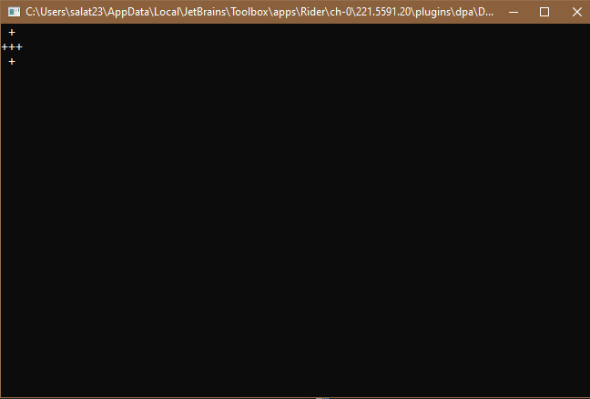

# How to draw with ST_ASCII

There are 2 ways you can use ST_ASCII:
- Manage everything by yourself
- Use AsciiEngine class to instantiate game loop and pass GameState's to control flow of your game

First one is pretty simple, all you have to do is create a new Ascii class instance and use Draw() method:

    Ascii ascii = new Ascii(80, 25);
    
    ascii.Draw(5, 5, "Hello world!");
    ascii.Draw(1, 1, '@', ConsoleColor.Red, ConsoleColor.White);

    Rectangle rectangle = new Rectangle(5, 5);
    ascii.Draw(5, 5, rectangle);

    ascii.Refresh();

**Don't forget to call Refresh() method at the end of your loop, it's purpose is to display everything you have drawn to console!**

Draw() method is capable of drawing individual char's as well as strings and instances of IDrawable. You specify the coordinates by either passing 2 int's or Vector2Int instance:

    Vector2Int cords = new Vector2Int(5, 5);
    ascii.Draw(cords, "Hello world!");

IDrawable allows you to define custom drawing behavior for different classes, for example lets create class that will plus sign with ascii characters when passed into the Draw() function:

    public class Cross : IDrawable
    {
        public void DrawSelf(Ascii ascii, int x, int y, ConsoleColor foreground, ConsoleColor background) {
            //We use ascii instance to draw

            ascii.Draw(x, y, '+', foreground, background);
            ascii.Draw(x, y + 1, '+', foreground, background);
            ascii.Draw(x, y - 1, '+', foreground, background);
            ascii.Draw(x + 1, y, '+', foreground, background);
            ascii.Draw(x - 1, y, '+', foreground, background);
        }
    }

And now we can use it:

    public static void Main() {
    
        Ascii ascii = new Ascii(80, 25);

        Cross cross = new Cross();

        ascii.Draw(1, 1, cross);

        ascii.Refresh();
    }

This is the result:

